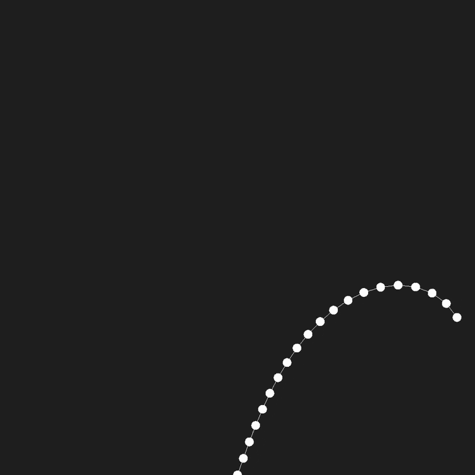
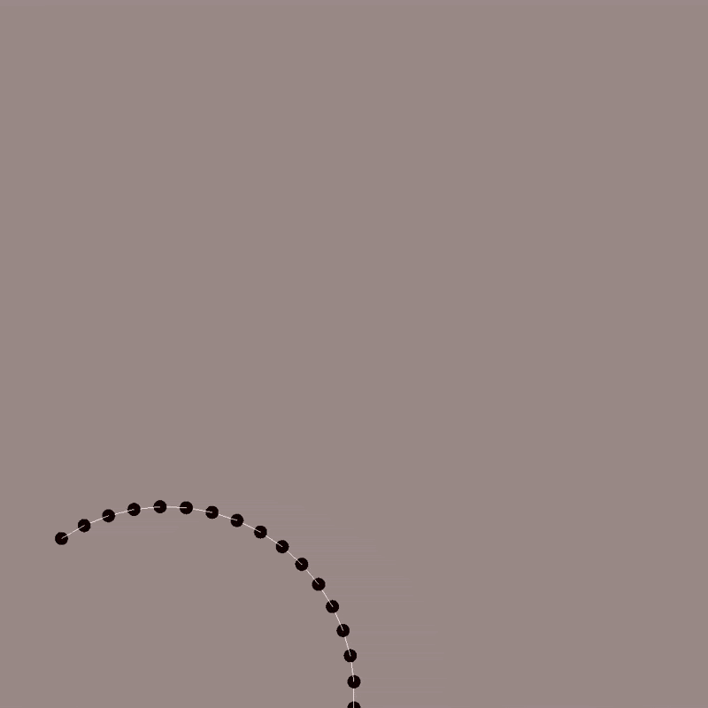
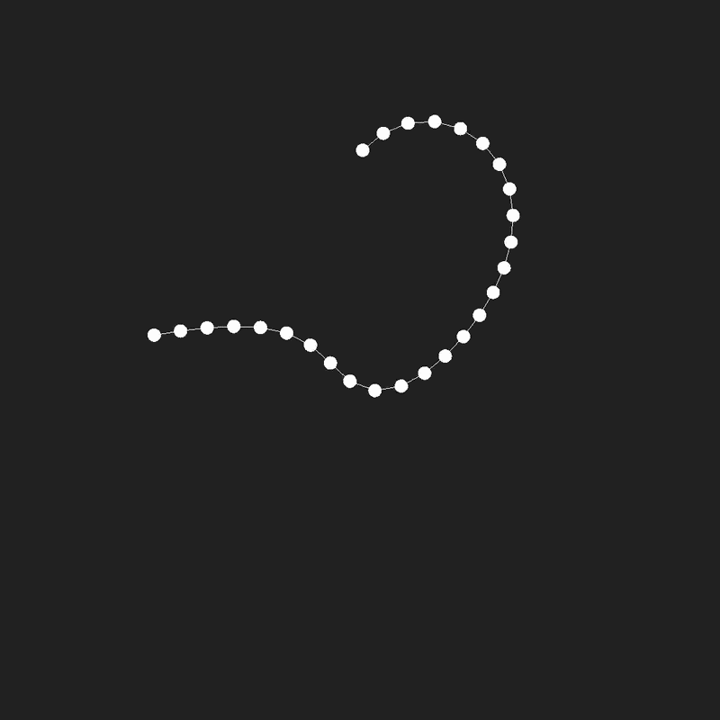
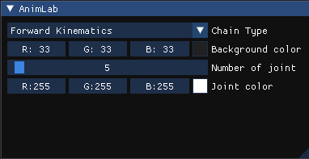
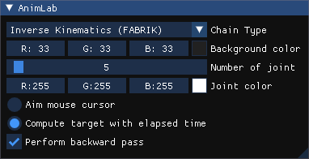

# AnimLab (WIP)

<table align="center">
  <tr>
    <td align="center">
      
      <br>
      <strong>Inverse Kinematics (FABRIK)</strong>
    </td>
    <td align="center">
      
      <br>
      <strong>Forward Kinematics</strong>
    </td>
    <td align="center">
      
      <br>
      <strong>Inverse Kinematics (without the backward pass)</strong>
    </td>
  </tr>
</table>

### How to compile

```bash
# Run these commands from the root directory
mkdir build
cd build
cmake ..
make
./animlab
```

### Controls

+ **Mouse :** Move the target position used for Inverse Kinematics (if the option is enabled in ImGui)
+ **Escape :** Close the window

### ImGui window

<table>
  <tr>
    <td>
      
    </td>
    <td style="padding-left: 15px;">
      <strong>Chain type :</strong> Select one of the available types for chain animation<br>
      <strong>Joint color :</strong> Set the color used when drawing the joints<br>
      <strong>Number of joints (2 to 100) :</strong> Add/Remove joints at the end of the chain<br>
    </td>
  </tr>
  <tr>
    <td>
      
    </td>
    <td style="padding-left: 15px;">
      <strong>Aim mouse cursor :</strong> Target position used for IK is the mouse position<br>
      <strong>Compute target with elapsed time :</strong> Target position used for IK is computed automatically to move along a circle<br>
      <strong>Perform backward pass :</strong> Enable the backward pass in the IK algorithm. If disabled, the chain will not be fixed to its origin<br>
    </td>
  </tr>
</table>